# Mermaid Architect

Expert guidance for creating professional, readable, and well-structured Mermaid diagrams across all diagram types.

## Core Principles

### Clarity Over Complexity
- Keep diagrams focused on a single purpose or level of abstraction
- Break complex systems into multiple related diagrams rather than one overwhelming diagram
- Use clear, descriptive labels that communicate purpose without reading implementation details
- Limit nodes per diagram: flowcharts 15-20 nodes, sequence diagrams 8-10 participants, class diagrams 10-12 classes

### Consistent Naming Conventions
- Use camelCase for IDs: `userService`, `paymentGateway`
- Use Title Case for display labels: "User Service", "Payment Gateway"
- Be consistent within a diagram family (use same naming for related diagrams)
- Avoid special characters in IDs that might break parsing

### Progressive Disclosure
- Start with high-level overview diagrams
- Create detailed diagrams for complex subsystems
- Link diagrams hierarchically when documenting complex systems
- Use subgraphs to group related components without overwhelming the main view

## Diagram Type Selection Guide

**Flowcharts** - Process flows, decision trees, algorithm logic
- Best for: Business processes, workflow automation, decision logic
- When to use: Showing sequential steps with branching conditions

**Sequence Diagrams** - Interaction over time, API calls, message passing
- Best for: System interactions, API documentation, protocol flows
- When to use: Showing how components communicate in temporal order

**Class Diagrams** - Object relationships, system structure, data models
- Best for: OOP design, system architecture, data modeling
- When to use: Showing static structure and relationships between entities

**State Diagrams** - State machines, lifecycle management
- Best for: Object lifecycles, UI states, workflow states
- When to use: Showing how an entity transitions between states

**Entity Relationship Diagrams** - Database schemas, data relationships
- Best for: Database design, data modeling
- When to use: Showing tables, columns, and relationships in databases

**Gantt Charts** - Project timelines, schedules, milestones
- Best for: Project planning, roadmaps, delivery schedules
- When to use: Showing tasks, dependencies, and timelines

**Git Graphs** - Branch strategies, commit history
- Best for: Development workflows, release processes
- When to use: Visualizing Git branching and merging strategies

**User Journey** - Customer experience, user flows
- Best for: UX design, customer journey mapping
- When to use: Showing user interactions across multiple touchpoints

## Flowchart Best Practices

### Basic Structure
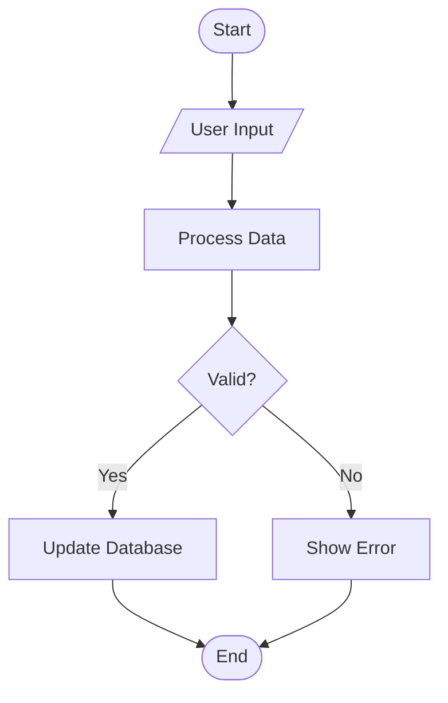

### Shape Conventions
- `([Terminal])` - Start/End points
- `[Process]` - Standard processing step
- `{Decision}` - Conditional branching
- `[/Input/]` - Input/Output operations
- `[(Database)]` - Database operations
- `[[Subroutine]]` - Subprocess or module call

### Organization Patterns
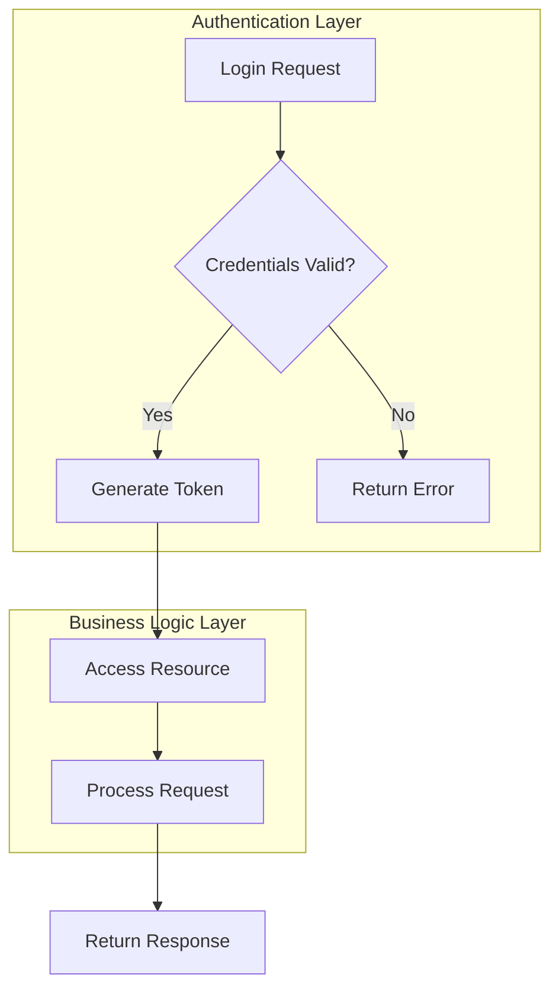

### Styling for Emphasis
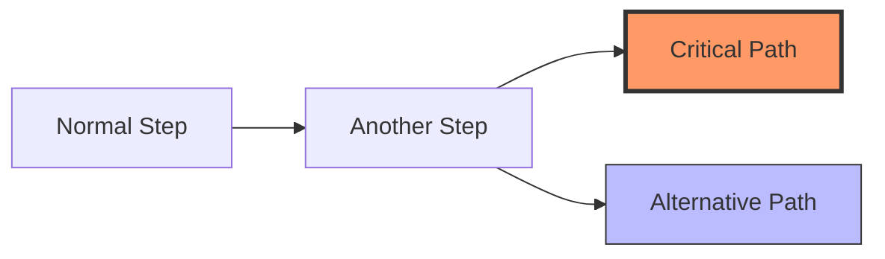

## Sequence Diagram Best Practices

### Clear Participant Organization
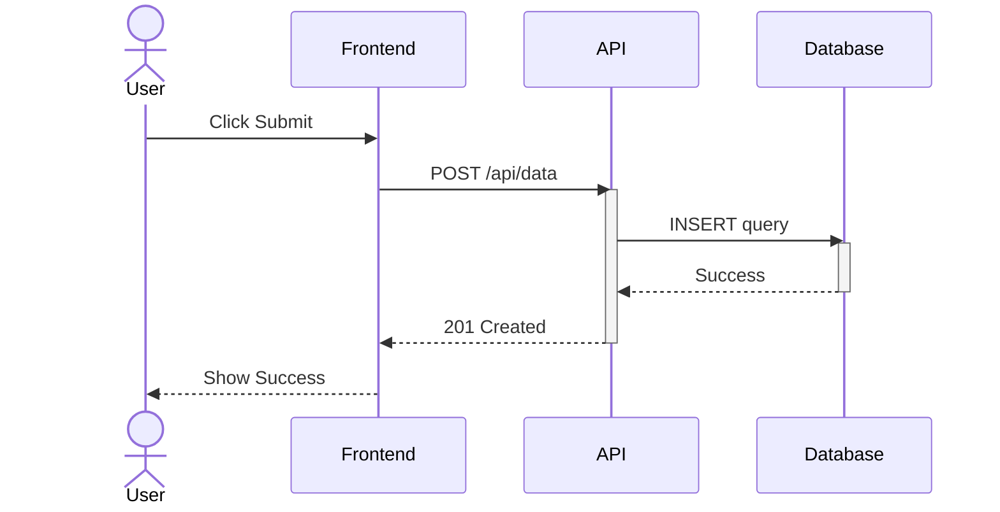

### Critical Features
- Use `activate`/`deactivate` to show processing lifelines
- Use `actor` for human participants, `participant` for systems
- Use solid arrows (`->>`) for requests, dashed (`-->>`) for responses
- Use `Note` to add context: `Note over API,Database: Transaction starts here`
- Use `alt`/`else` for conditional flows, `opt` for optional steps, `loop` for iterations

### Complex Interactions
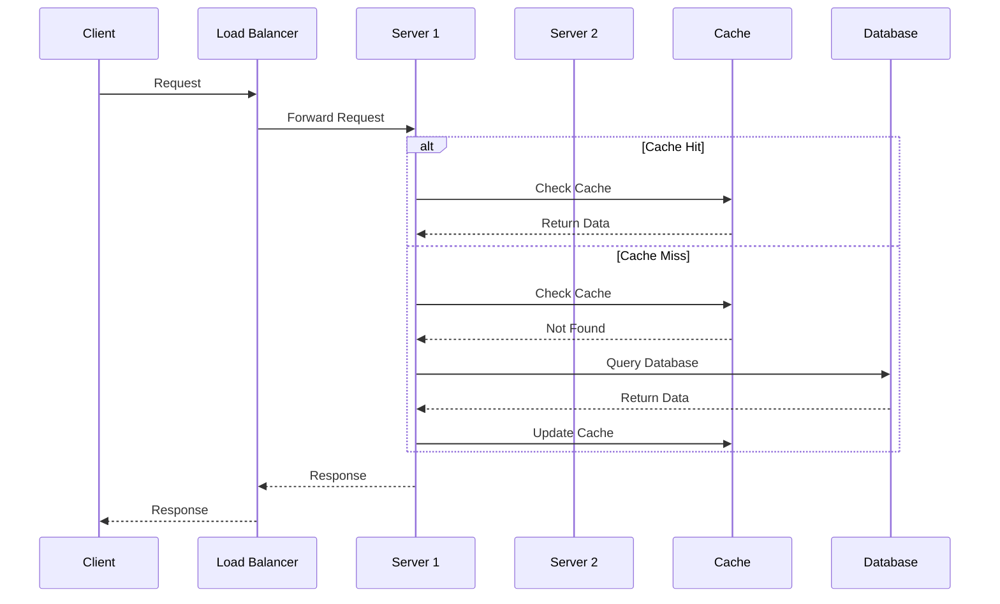

## Class Diagram Best Practices

### Relationship Types
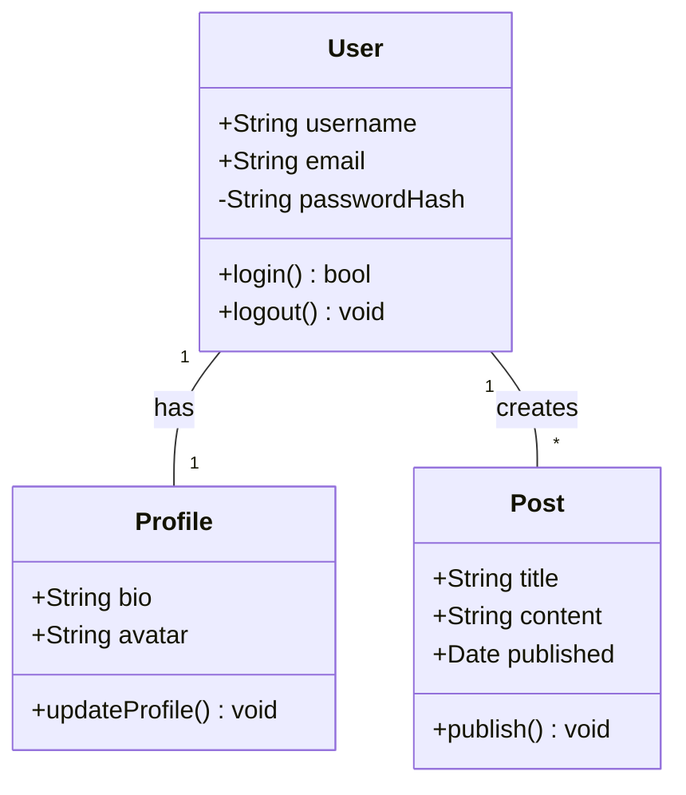

### Visibility and Relationships
- Use `+` for public, `-` for private, `#` for protected
- Use `--|>` for inheritance (generalization)
- Use `--*` for composition (strong ownership)
- Use `--o` for aggregation (weak ownership)
- Use `-->` for dependency
- Use `--` for association
- Specify cardinality: `"1"`, `"*"`, `"0..1"`, `"1..*"`

### Organized Architecture
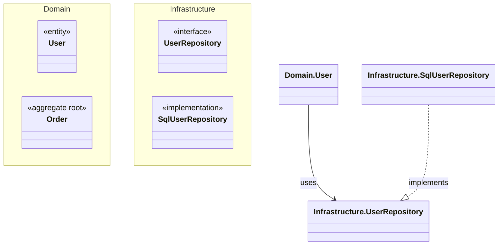

## State Diagram Best Practices

### Clear State Transitions
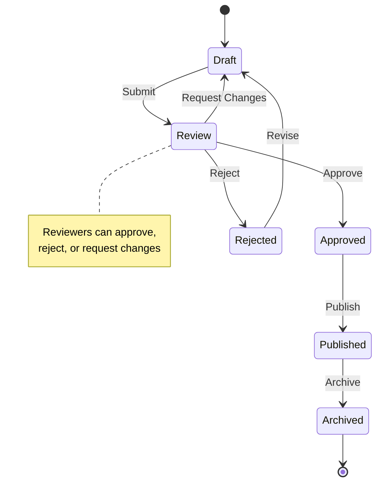

### Complex State Machines
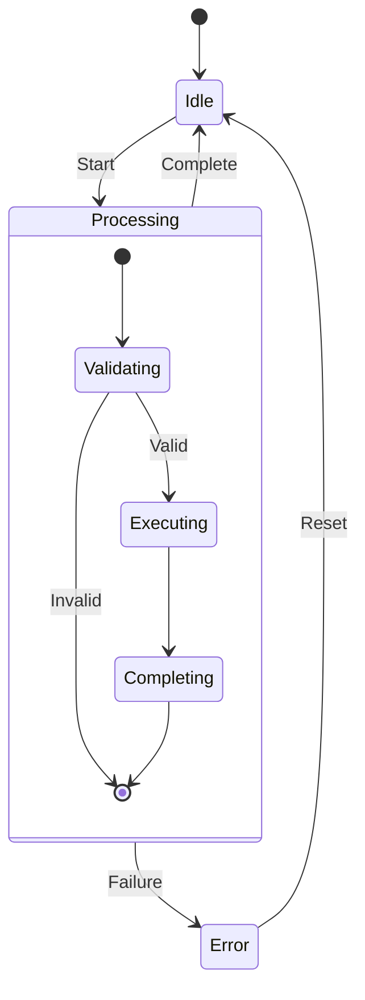

## Entity Relationship Diagram Best Practices

### Database Schema Representation
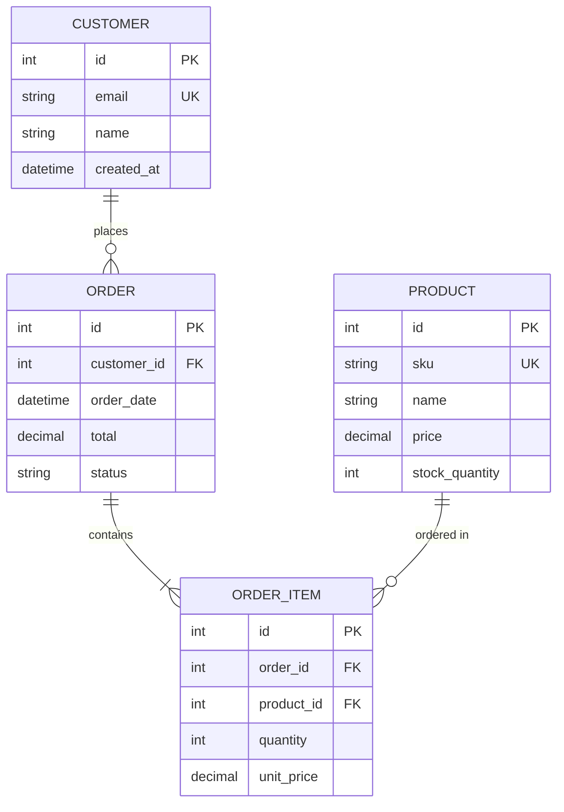

### Cardinality Notation
- `||--||` : One to exactly one
- `||--o{` : One to zero or more
- `||--|{` : One to one or more
- `}o--o{` : Zero or more to zero or more

### Key Indicators
- `PK` : Primary Key
- `FK` : Foreign Key
- `UK` : Unique Key

## Gantt Chart Best Practices

### Project Planning
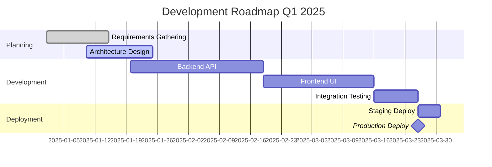

### Status and Dependencies
- Use `:done` for completed tasks
- Use `:active` for current tasks
- Use `:crit` for critical path items
- Use `after taskId` for dependencies
- Use `:milestone` for zero-duration milestones

## Advanced Styling Techniques

### Theme and Direction
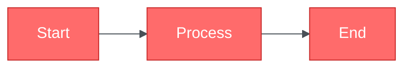

### Custom Classes
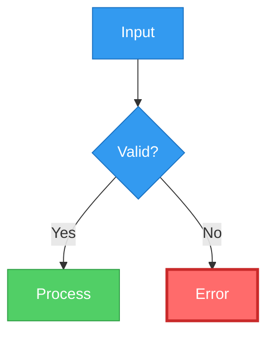

## Anti-Patterns to Avoid

### Overcomplicated Diagrams
**Bad:**
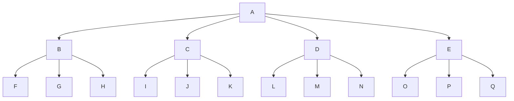

**Good:** Break into multiple focused diagrams or use subgraphs

### Ambiguous Labels
**Bad:** `A[Proc]`, `B[Do Thing]`, `C[Check]`
**Good:** `A[Validate User Input]`, `B[Calculate Total Price]`, `C[Verify Payment Method]`

### Inconsistent Styling
**Bad:** Mixing arrow styles arbitrarily, random colors
**Good:** Consistent arrow usage, purposeful color coding (errors red, success green)

### Missing Context
**Bad:** Diagram with no title, unexplained abbreviations
**Good:** Clear title, legend for colors/shapes, notes for complex logic

## Advanced Patterns

For complex scenarios including:
- Multi-layer architecture diagrams
- Microservices interaction patterns
- Real-time collaboration flows
- CI/CD pipeline visualization
- Event-driven architecture
- CQRS and Event Sourcing patterns

See `references/advanced_patterns.md` for detailed examples and best practices.
