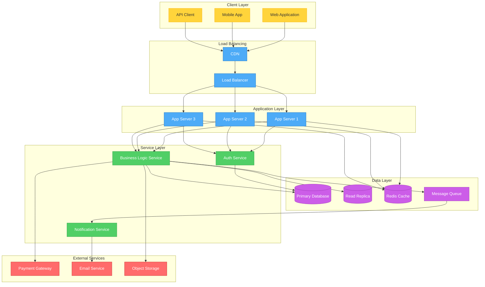

```mermaid
flowchart TB
    subgraph "Client Layer"
        Web[Web Application]
        Mobile[Mobile App]
        API_Client[API Client]
    end
    
    subgraph "Load Balancing"
        LB[Load Balancer]
        CDN[CDN]
    end
    
    subgraph "Application Layer"
        direction LR
        App1[App Server 1]
        App2[App Server 2]
        App3[App Server 3]
    end
    
    subgraph "Service Layer"
        Auth[Auth Service]
        Business[Business Logic Service]
        Notification[Notification Service]
    end
    
    subgraph "Data Layer"
        PrimaryDB[(Primary Database)]
        ReplicaDB[(Read Replica)]
        Cache[(Redis Cache)]
        Queue[Message Queue]
    end
    
    subgraph "External Services"
        Payment[Payment Gateway]
        Email[Email Service]
        Storage[Object Storage]
    end
    
    Web & Mobile & API_Client --> CDN
    CDN --> LB
    LB --> App1 & App2 & App3
    
    App1 & App2 & App3 --> Auth
    App1 & App2 & App3 --> Business
    App1 & App2 & App3 --> Cache
    
    Business --> Queue
    Queue --> Notification
    
    Auth --> PrimaryDB
    Business --> PrimaryDB
    Business --> ReplicaDB
    
    Notification --> Email
    Business --> Payment
    Business --> Storage
    
    classDef client fill:#ffd43b,stroke:#fab005
    classDef app fill:#4dabf7,stroke:#1971c2,color:#fff
    classDef service fill:#51cf66,stroke:#2f9e44,color:#fff
    classDef data fill:#cc5de8,stroke:#9c36b5,color:#fff
    classDef external fill:#ff6b6b,stroke:#c92a2a,color:#fff
    
    class Web,Mobile,API_Client client
    class LB,CDN,App1,App2,App3 app
    class Auth,Business,Notification service
    class PrimaryDB,ReplicaDB,Cache,Queue data
    class Payment,Email,Storage external
```
