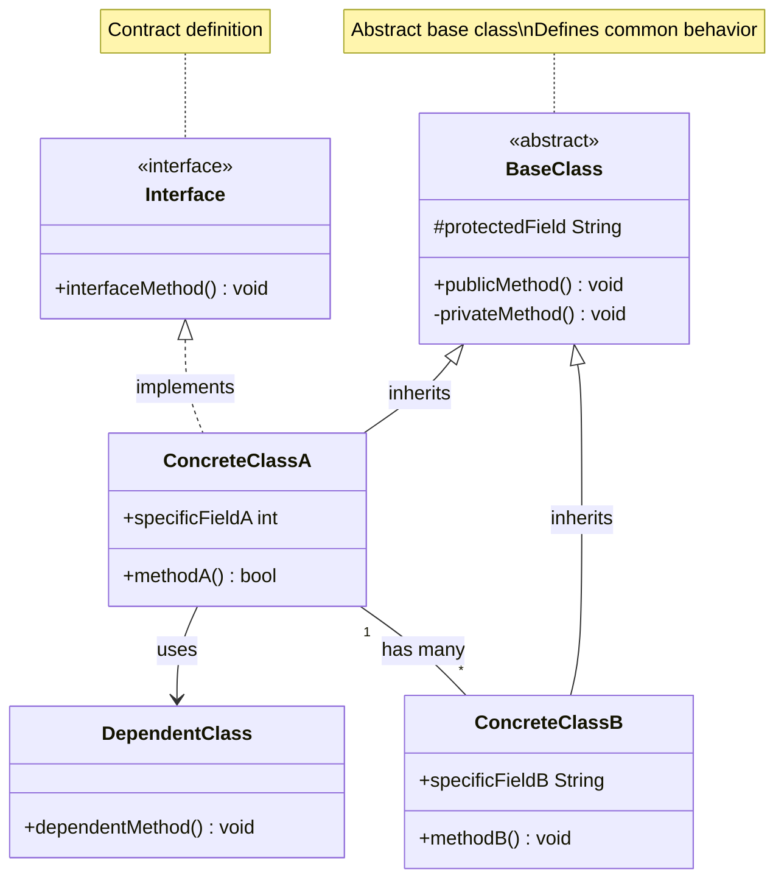

```mermaid
classDiagram
    class BaseClass {
        <<abstract>>
        #protectedField String
        +publicMethod() void
        -privateMethod() void
    }
    
    class ConcreteClassA {
        +specificFieldA int
        +methodA() bool
    }
    
    class ConcreteClassB {
        +specificFieldB String
        +methodB() void
    }
    
    class Interface {
        <<interface>>
        +interfaceMethod() void
    }
    
    class DependentClass {
        +dependentMethod() void
    }
    
    BaseClass <|-- ConcreteClassA : inherits
    BaseClass <|-- ConcreteClassB : inherits
    Interface <|.. ConcreteClassA : implements
    ConcreteClassA --> DependentClass : uses
    ConcreteClassA "1" -- "*" ConcreteClassB : has many
    
    note for BaseClass "Abstract base class\nDefines common behavior"
    note for Interface "Contract definition"
```
