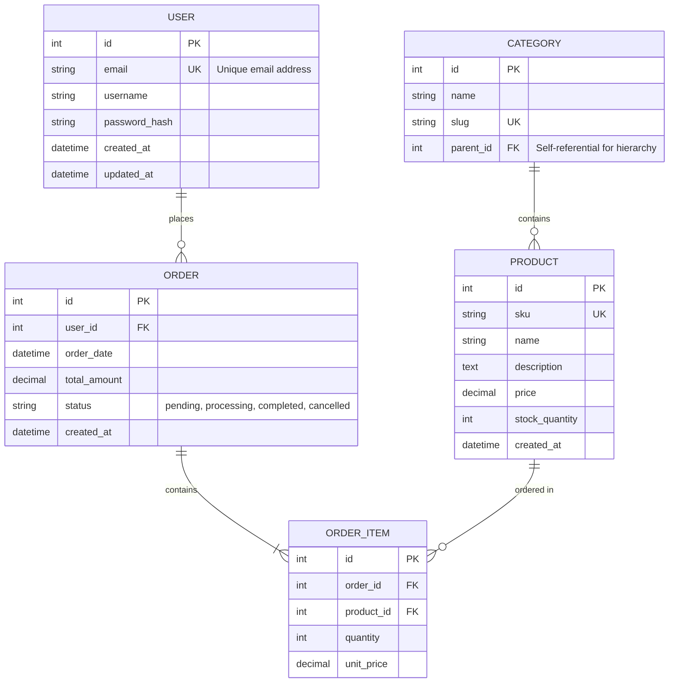

```mermaid
erDiagram
    USER ||--o{ ORDER : places
    USER {
        int id PK
        string email UK "Unique email address"
        string username
        string password_hash
        datetime created_at
        datetime updated_at
    }
    
    ORDER ||--|{ ORDER_ITEM : contains
    ORDER {
        int id PK
        int user_id FK
        datetime order_date
        decimal total_amount
        string status "pending, processing, completed, cancelled"
        datetime created_at
    }
    
    PRODUCT ||--o{ ORDER_ITEM : "ordered in"
    PRODUCT {
        int id PK
        string sku UK
        string name
        text description
        decimal price
        int stock_quantity
        datetime created_at
    }
    
    ORDER_ITEM {
        int id PK
        int order_id FK
        int product_id FK
        int quantity
        decimal unit_price
    }
    
    CATEGORY ||--o{ PRODUCT : contains
    CATEGORY {
        int id PK
        string name
        string slug UK
        int parent_id FK "Self-referential for hierarchy"
    }
```
