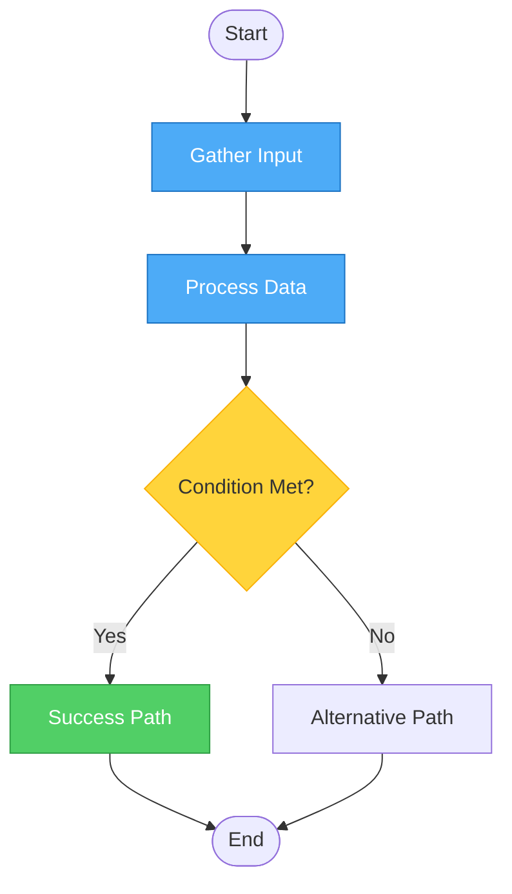

```mermaid
flowchart TD
    Start([Start]) --> Input[Gather Input]
    Input --> Process[Process Data]
    Process --> Decision{Condition Met?}
    Decision -->|Yes| Success[Success Path]
    Decision -->|No| Alternative[Alternative Path]
    Success --> End([End])
    Alternative --> End
    
    classDef processStyle fill:#4dabf7,stroke:#1971c2,color:#fff
    classDef decisionStyle fill:#ffd43b,stroke:#fab005
    classDef successStyle fill:#51cf66,stroke:#2f9e44,color:#fff
    classDef errorStyle fill:#ff6b6b,stroke:#c92a2a,color:#fff
    
    class Process,Input processStyle
    class Decision decisionStyle
    class Success successStyle
```
