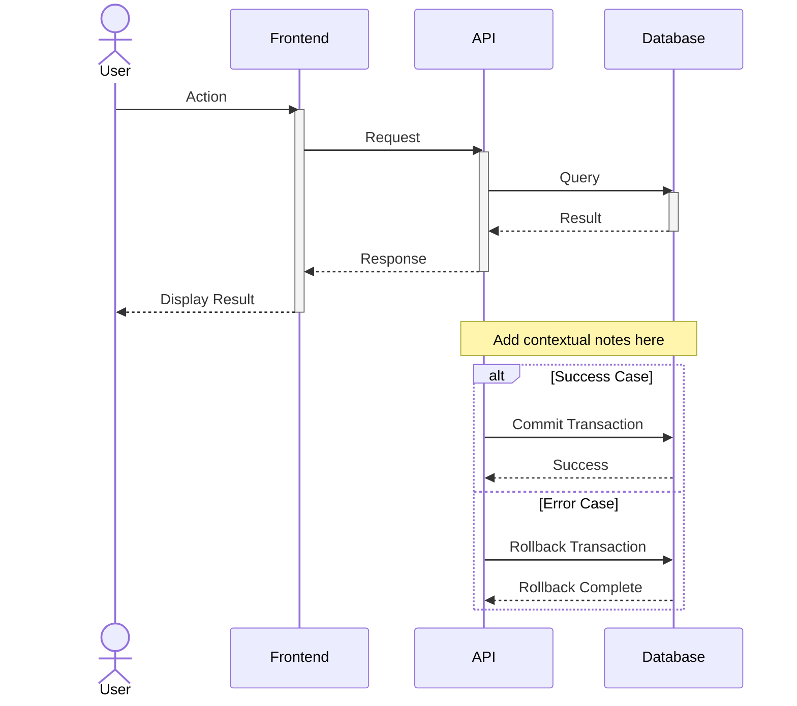

```mermaid
sequenceDiagram
    actor User
    participant Frontend
    participant API
    participant Database
    
    User->>Frontend: Action
    activate Frontend
    Frontend->>API: Request
    activate API
    
    API->>Database: Query
    activate Database
    Database-->>API: Result
    deactivate Database
    
    API-->>Frontend: Response
    deactivate API
    Frontend-->>User: Display Result
    deactivate Frontend
    
    Note over API,Database: Add contextual notes here
    
    alt Success Case
        API->>Database: Commit Transaction
        Database-->>API: Success
    else Error Case
        API->>Database: Rollback Transaction
        Database-->>API: Rollback Complete
    end
```
