# Advanced Mermaid Patterns

This reference provides complex, real-world patterns for advanced Mermaid diagram scenarios.

## Microservices Architecture

### Service Mesh Communication
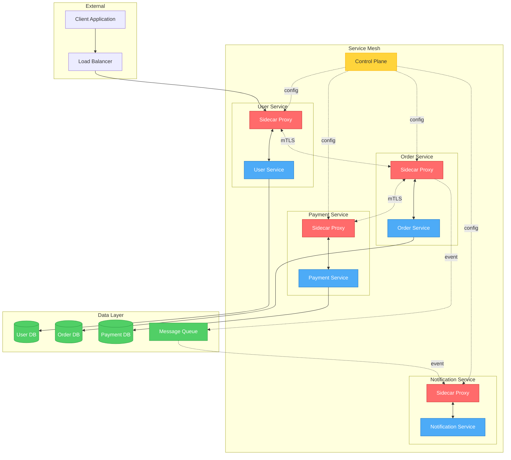

## Event-Driven Architecture

### CQRS with Event Sourcing
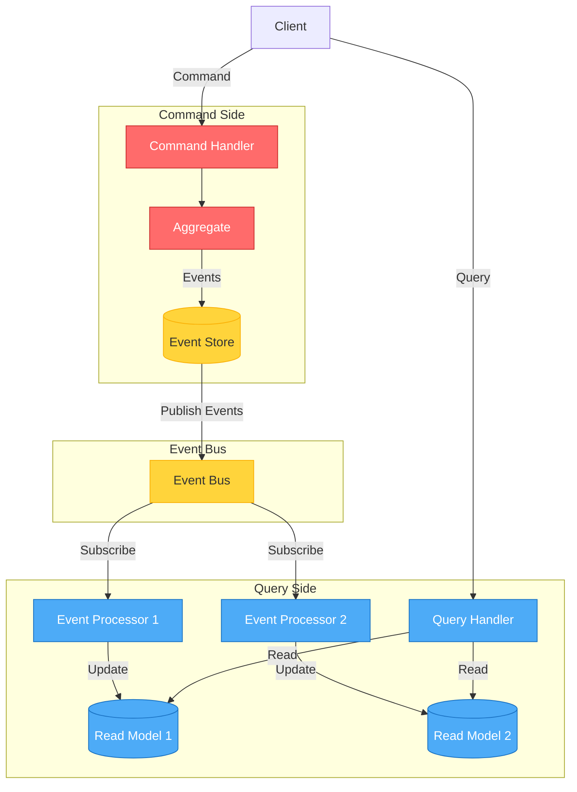

### Saga Pattern for Distributed Transactions
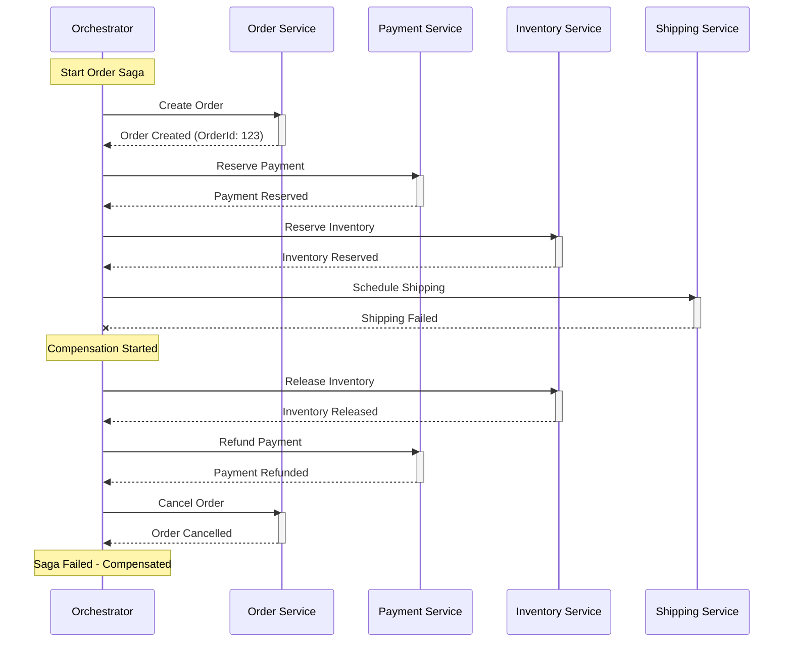

## CI/CD Pipeline Visualization

### Complete DevOps Pipeline
```mermaid
flowchart LR
    subgraph "Source Control"
        GH[GitHub]
        PR[Pull Request]
    end
    
    subgraph "CI Pipeline"
        direction TB
        Lint[Linting]
        Test[Unit Tests]
        Build[Build]
        Scan[Security Scan]
        Int[Integration Tests]
    end
    
    subgraph "Artifact Management"
        Reg[Container Registry]
        Art[Artifact Store]
    end
    
    subgraph "CD Pipeline"
        direction TB
        Dev[Dev Deploy]
        Stage[Staging Deploy]
        Prod[Production Deploy]
    end
    
    subgraph "Monitoring"
        direction TB
        Mon[Monitoring]
        Log[Logging]
        Alert[Alerting]
    end
    
    GH --> PR
    PR -->|Merge| Lint
    Lint --> Test
    Test --> Build
    Build --> Scan
    Scan --> Int
    Int --> Reg
    Int --> Art
    
    Reg --> Dev
    Dev -->|Promote| Stage
    Stage -->|Approve| Prod
    
    Dev & Stage & Prod --> Mon
    Mon --> Log
    Log --> Alert
    
    classDef source fill:#ffd43b,stroke:#fab005
    classDef ci fill:#4dabf7,stroke:#1971c2,color:#fff
    classDef artifact fill:#51cf66,stroke:#2f9e44,color:#fff
    classDef cd fill:#ff6b6b,stroke:#c92a2a,color:#fff
    classDef monitor fill:#cc5de8,stroke:#9c36b5,color:#fff
    
    class GH,PR source
    class Lint,Test,Build,Scan,Int ci
    class Reg,Art artifact
    class Dev,Stage,Prod cd
    class Mon,Log,Alert monitor
```

## Complex State Machines

### Order Processing Lifecycle
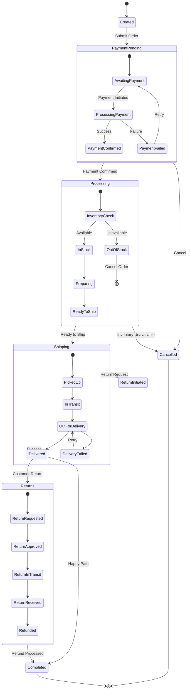

## Multi-Layer Architecture

### Hexagonal Architecture (Ports and Adapters)
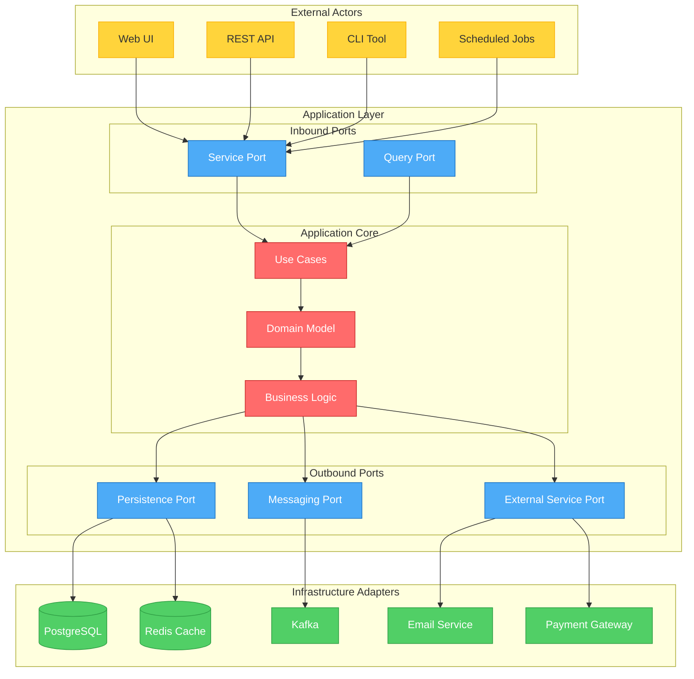

## Real-Time Collaboration System

### WebSocket Communication Flow
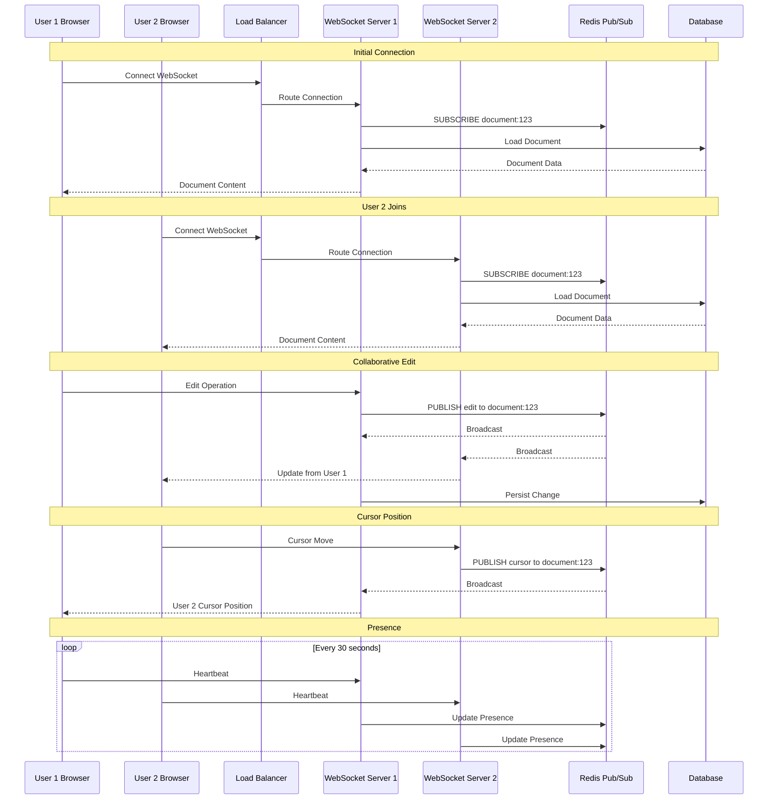

## Data Flow Architecture

### ETL Pipeline with Error Handling
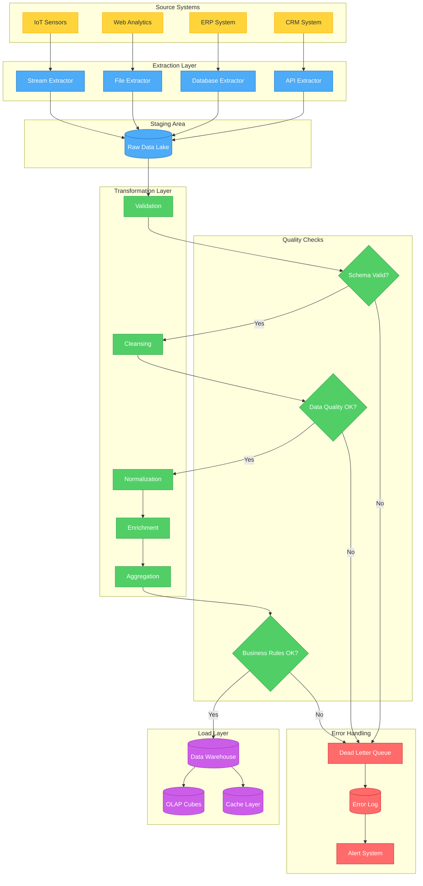

## Complex Class Hierarchies

### Plugin Architecture
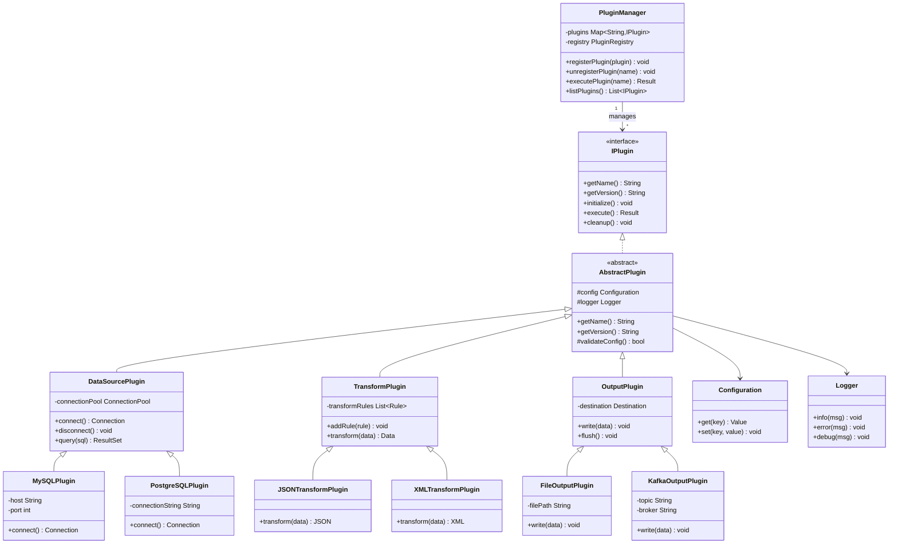

## Deployment Architecture

### Blue-Green Deployment with Canary
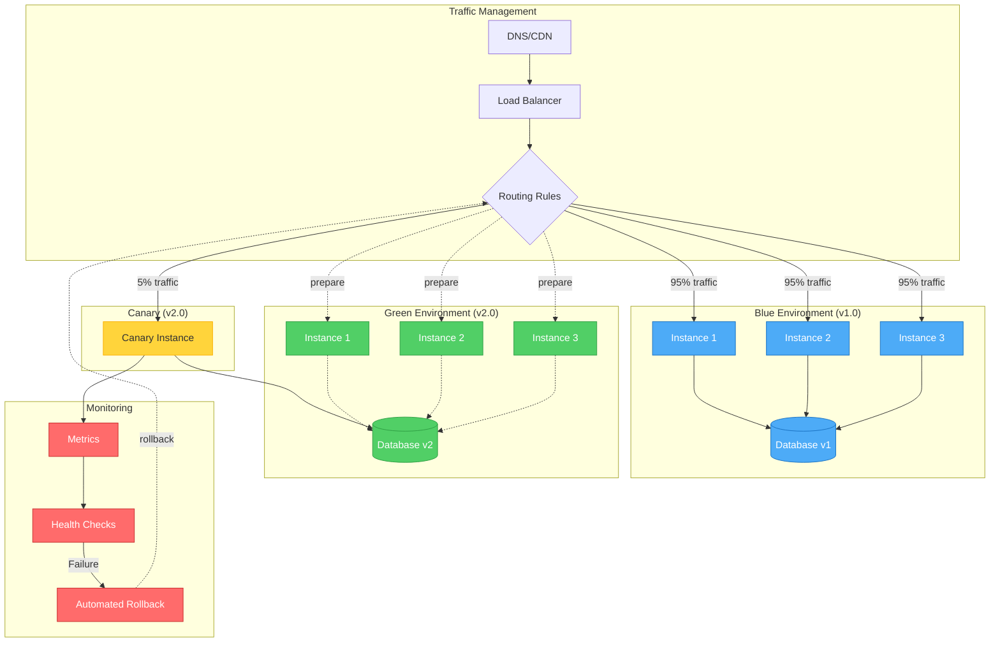

## User Journey Mapping

### E-Commerce Purchase Flow
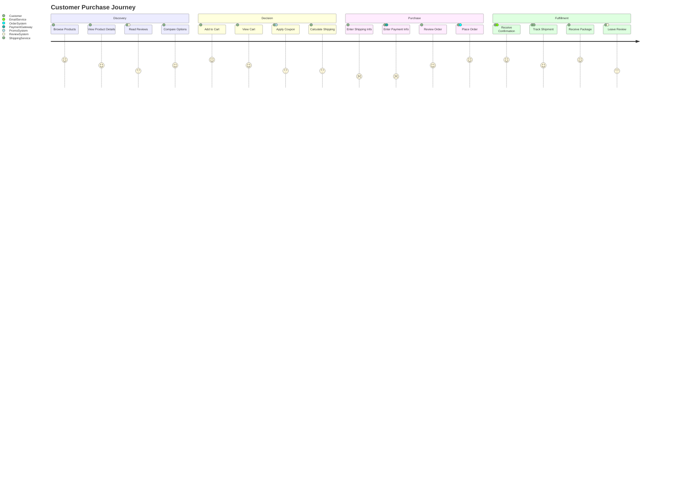

## Timeline and Roadmap

### Product Development Phases
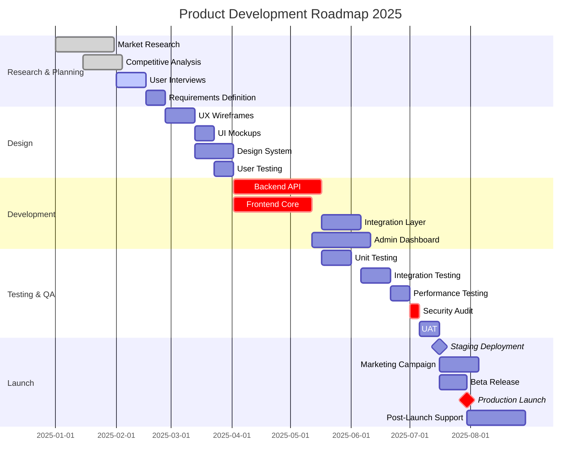

## Best Practices Summary

1. **Limit Complexity**: Keep diagrams focused on one aspect of the system
2. **Use Subgraphs**: Group related components for better organization
3. **Consistent Styling**: Apply color coding purposefully (errors red, success green)
4. **Clear Labels**: Use descriptive, business-friendly terminology
5. **Progressive Disclosure**: Start high-level, provide detailed sub-diagrams as needed
6. **Document Assumptions**: Use notes to clarify complex logic or decisions
7. **Version Control**: Include diagram version/date for documentation purposes
8. **Accessibility**: Ensure color choices work for colorblind users
9. **Maintenance**: Keep diagrams updated as systems evolve
10. **Tool Integration**: Link diagrams to live documentation and code
